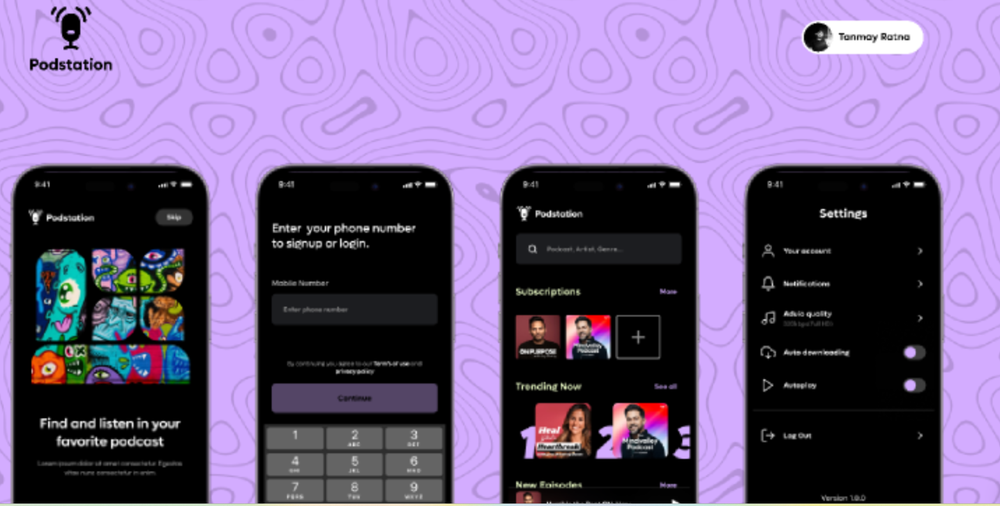

### PodStation APP

Este projeto foi criado com o propósito de praticar o **levantamento de requisitos** do projeto Podstation APP. O prototipo deste projeto foi disponbilizado pelo usuario tanmayratna no Figma sendo acessível a toda comunidade onde vários designers tem a possibilidade de colaborar com o projeto.

- Protótipo do Figma [PodStationApp](https://www.figma.com/design/GY2qvm3Ht4wUFlt1ytJ7j8/Podstation---Podcast-App-(Community)?node-id=0-1&node-type=canvas&
  

## Análise do Projeto

Para a realização do levantamento de requisitos do PodStation App foi utilizado o **MIRO**, conforme imagem abaixo.
![Referência da análise(../img/rf_analise.png)
1.Indicação da imagem a ser analisada
2.Indicação de qual requerimento iremos analisar, indicando seu número e nome
3.Descrição em alto da funcionalidade, indicando ao que irá utilizar, a funcionalidade desejada e o porque da existência desta funcionalidade
4.Listagem das regras de negócio a serem implementadas.

### Referência de análise

- Req 1
- Req 2
- Req 3
- Req 4
- Req 5
- Req 6
- Req 7
- Req 8-
- Req 9
- Req 10
