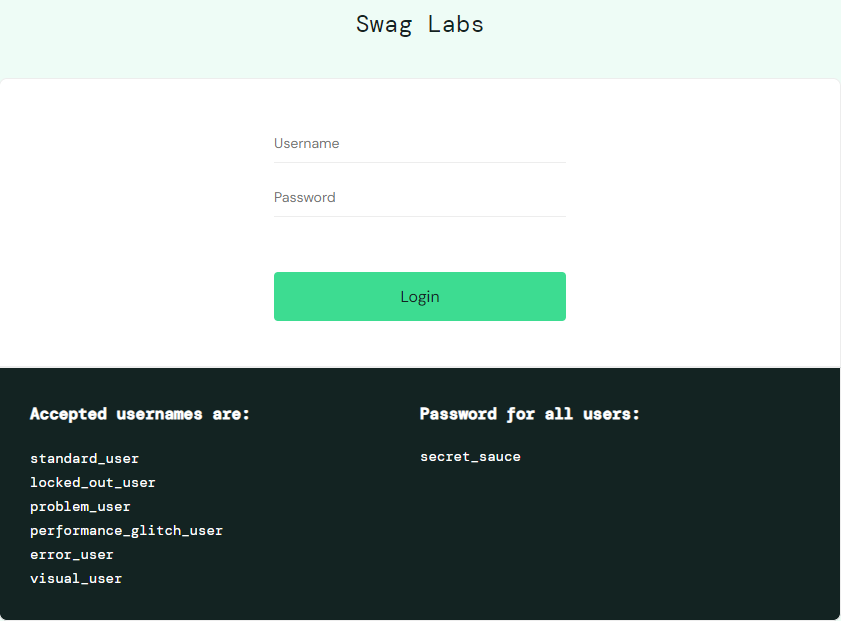

### Projeto Saucedemo

Este projeto foi criado com o intuito de praticar a criação e execução do **Plano de Teste** de um site já existente, levantando seus requisitos, criando suites e casos de testes pasra execução.

## Ferramentas

- Site Saucedemo [Saucedemo](https://www.saucedemo.com)

- Excel para a criação do Plano de Teste

## Plano de Teste

### Apresentação do Plano

Na aba introdução da Planilha irá conter todas as informações bases do projeto.

### Apresentação da Suíte

Na aba Suite \_(nome do requisito) irá conter todas as informações necessárias para execução dos testes vinculadas a Suíte.

Entre Eles:

- Objetivo do teste
- Tempo de Excecução:
- Protótipo:
- Pré condição:
- Dados Necessários:
- Critério de aceite:
- Requisitos:
- Casos dde teste:
- Prioridade:
- Severidade:

